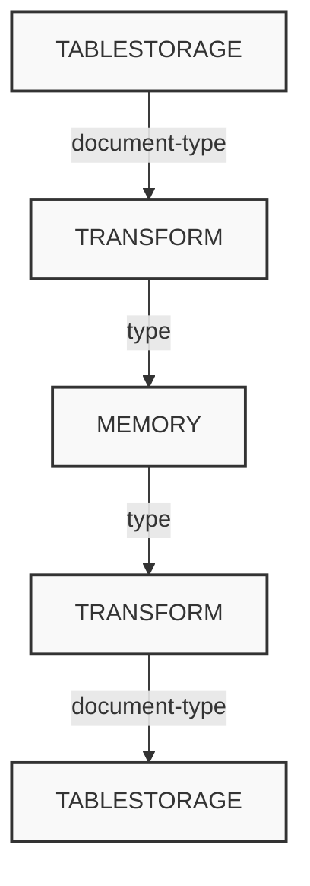
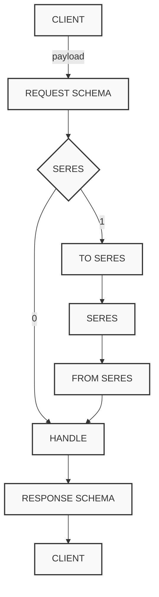
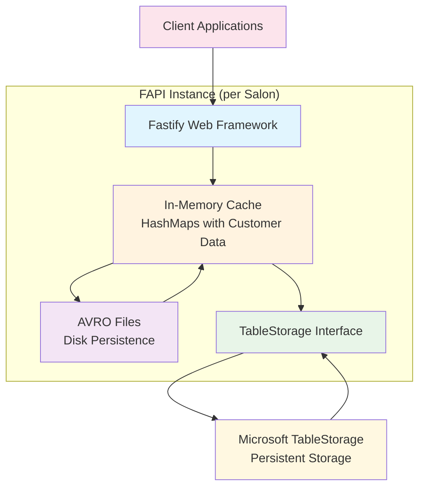

# FAPI Architecture Charts

## Load and Save Data from Disk

This diagram shows the data flow for loading and saving data from disk using AVRO files and schemas.

**Note:** No property transformation and no value transformation is being applied to the persisted objects. For persisting the in-memory objects a avro schema is being used, which has to define all properties and values of the in-memory object.

## Load and Save Document-Types from TableStorage

This diagram illustrates the bidirectional data flow between TableStorage and Memory through Transform operations.

**Note:** While loading the document-types from the tablestorage into the memory, properties and values are getting transformed. The transforming process has to be reversed, while persisting the in-memory objects to the tablestorage.

## Request Lifecycle

This diagram shows the complete request lifecycle flow through the SERES system.

## Architecture Overview

Based on the context documentation, the FAPI system architecture can be summarized as:

### Key Components:

- **Fastify Framework**: JavaScript-based web framework handling HTTP requests
- **In-Memory Cache**: HashMaps storing all customer data (several GB per instance)
- **AVRO Files**: Disk-persisted files for fast startup data loading
- **TableStorage**: Microsoft's key-value cloud storage for persistent data
- **Delta Loading**: Only changes are loaded from TableStorage, bulk data from AVRO files

### Available Functions:

- Shift schedules (Schichtpläne)
- Available appointment calculation
- Appointment display

## State Initialization Process

This diagram shows the complete state initialization flow from startup to ready state.

### Initialization Steps:

1. **STATE INITIALISING**: Application startup begins
2. **Start queue and listen**: Initialize message queue and start listening for requests
3. **Read from filesystem**: Load bulk data from AVRO files on disk
4. **Read from tablestorage**: Load delta changes based on timestamp from TableStorage
5. **STATE READY**: Application is fully initialized and ready to serve requests

The process ensures that the in-memory cache is populated with both the bulk data (from filesystem) and the latest changes (from tablestorage) before the application becomes ready to handle requests.
